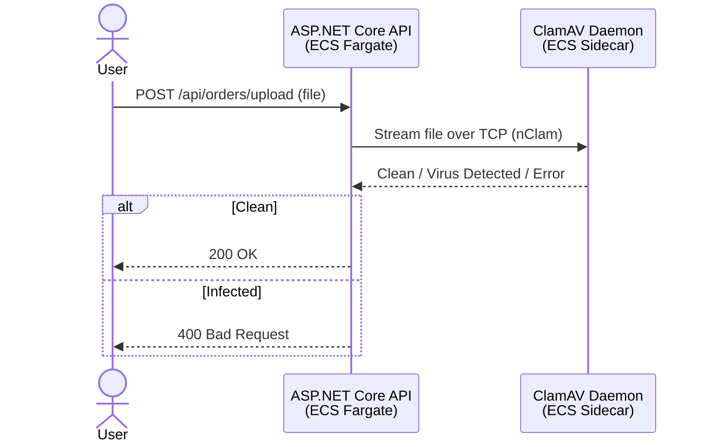
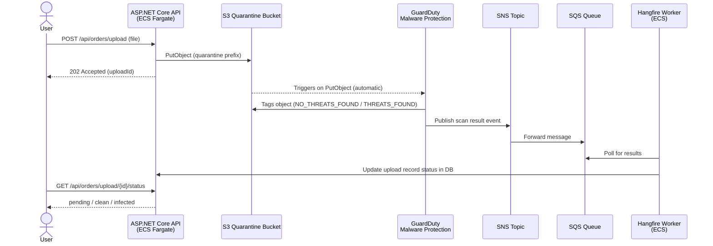
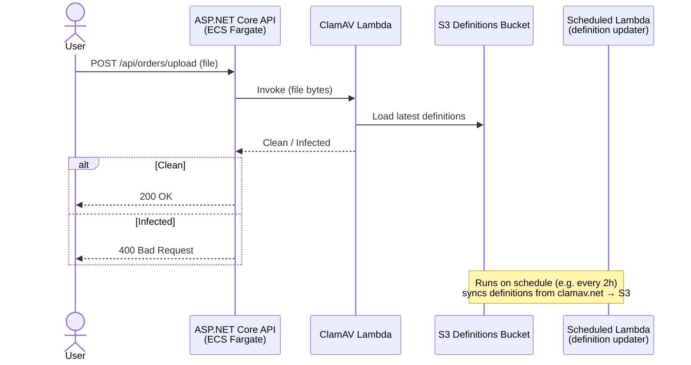

# Antivirus Scanning — Architecture Options

## Background

The JASPER API currently accepts file uploads via `POST /api/orders/upload`. ClamAV has been integrated using the `nClam` library, which streams the file over TCP to a `clamd` daemon running as a sidecar container. An ASP.NET Core health check (`GET /api/health`) monitors both daemon reachability and definition freshness.

The purpose of this discussion is to decide whether the current approach is the right long-term architecture, or whether a more managed AWS-native option better fits our stack and requirements.

---

## Current Implementation (Option C — ClamAV Sidecar)



**Definition updates:** `freshclamd` runs inside the container and polls `database.clamav.net` hourly. A health check endpoint reports staleness if definitions are older than 7 days.

---

## Option A — Amazon GuardDuty Malware Protection

Files are uploaded to a quarantine S3 bucket. GuardDuty automatically scans newly uploaded objects and tags them with the result. The API waits for the tag asynchronously via SQS/SNS + Hangfire.



---

## Option B — ClamAV Lambda Layer

A Lambda function packages ClamAV + definitions as a layer. The API invokes the Lambda synchronously. A scheduled Lambda refreshes definitions from `database.clamav.net` to S3.



> **Hard limit:** AWS Lambda has a 6MB synchronous invocation payload limit. Files larger than this cannot be passed directly — they would need to be staged to S3 first and read by the Lambda, adding complexity.

---

## Comparison

| Criteria                   | A — GuardDuty                 | B — Lambda                        | C — ClamAV Sidecar                    |
| -------------------------- | ----------------------------- | --------------------------------- | ------------------------------------- |
| **File size limit**        | None                          | 6MB direct (workaround via S3)    | Configurable (default 25MB, raisable) |
| **Synchronous scan**       | No (async)                    | Yes                               | Yes                                   |
| **Definition management**  | Fully managed by AWS          | Semi-managed (scheduled Lambda)   | `freshclamd` in container             |
| **Data leaves your infra** | Yes — S3 → GuardDuty          | No — Lambda in VPC                | No — in-process                       |
| **Detection quality**      | Commercial AV engine          | ClamAV                            | ClamAV                                |
| **Cost**                   | ~$0.37 / GB scanned           | Lambda invocation cost (low)      | Container resource cost only          |
| **Local dev support**      | No (AWS only)                 | No (AWS only)                     | Yes (Docker)                          |
| **Ops burden**             | Lowest                        | Medium                            | Medium                                |
| **Infrastructure changes** | New: S3, SNS, SQS, async flow | New: Lambda layer, S3 defs bucket | Already implemented                   |

---

## Questions to Answer Before Deciding

These questions will determine which option is appropriate:

1. **Compliance** — Are there data residency or sovereignty rules that prohibit file content leaving our own infrastructure? _(eliminates GuardDuty if yes)_
2. **Security policy** — Does the org's security standard mandate a specific AV engine or certification? _(may eliminate ClamAV)_
3. **File sizes** — What is the maximum expected file size? _(eliminates Lambda B if >6MB without extra complexity)_
4. **UX expectation** — Must scanning be synchronous from the user's perspective, or is a "pending → clean" flow acceptable? _(async is required for GuardDuty)_
5. **Support tier** — Are we on AWS Business/Enterprise support? _(required for GuardDuty Health API integration)_
6. **Local dev** — Do developers need scanning to work without AWS credentials? _(only Option C supports this)_
7. **Volume** — How many file uploads per day/month? _(affects GuardDuty cost)_
8. **Ownership** — Does the team want to own the AV infrastructure long-term, or prefer zero-ops? _(GuardDuty wins if zero-ops is preferred)_

---

## Recommendation Framework

```
Is there a mandated AV tool / compliance standard?
├── Yes → Follow the mandate (likely rules out GuardDuty and ClamAV both)
└── No
    └── Does data sovereignty prohibit files leaving our infra?
        ├── Yes → Option C (ClamAV Sidecar) or Option B (Lambda in VPC)
        └── No
            └── Is a synchronous scan required?
                ├── Yes → Option B (Lambda) or Option C (ClamAV Sidecar)
                └── No → Option A (GuardDuty) — lowest ops burden
```

---

## Current Status

- Option C is **already implemented and working**.
- Health check at `GET /api/health` monitors daemon reachability and definition age.
- `freshclamd` handles automatic definition updates inside the container.
- `StreamMaxLength` can be raised via `CLAMD_CONF_StreamMaxLength` env var if larger files are needed.

**The ClamAV sidecar approach requires no further work unless compliance or detection quality requirements drive a change.**
