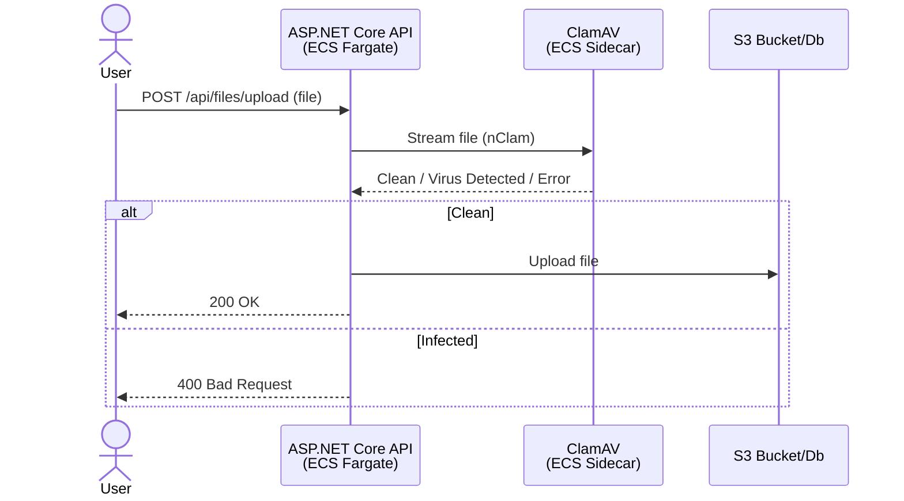
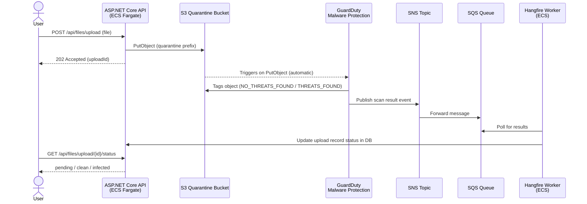

# Antivirus Scanning Options

## ClamAV

## AWS Guard Duty

## Questions

1. Would there be a chance moving forward that judges will upload sensitive documents that should only live in Emerald?
2. Is there a limit of the file size the judge will upload?
3. How does the upload experience would like look in the Frontend?
4. GuardDuty appears to cost more.
